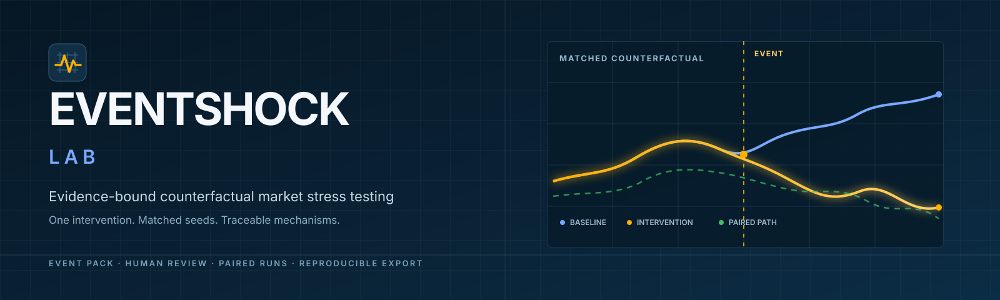

<p align="right">
  <strong>English</strong> · <a href="README.zh-CN.md">简体中文</a>
</p>



# EventShock Lab

<p align="center">
  <strong>Change one condition. See whether the same simulated shock gets worse.</strong>
</p>

<p align="center">
  <a href="https://github.com/Mike-Zhuang/EventShock/actions/workflows/ci.yml"></a>
  
  
  <a href="LICENSE"></a>
</p>

<p align="center">
  <a href="https://eventshock.mikezhuang.cn"><strong>Open the live product</strong></a>
  · <a href="#two-minute-product-tour">Product tour</a>
  · <a href="#run-it-locally">Run locally</a>
  · <a href="https://github.com/Mike-Zhuang/EventShock/issues/new/choose">Report an issue</a>
</p>

EventShock Lab is a deployed research prototype for **market event-risk analysts, institutional research teams, and behavioral-finance educators**. It compares a baseline simulation with a matched simulation in which exactly one declared condition changes. The product helps people investigate a mechanism; it does not replace their judgment with a prediction.

> [!IMPORTANT]
> Every price path, order book, flow, agent action, and counterfactual effect is synthetic. Results are conditional on the selected evidence, model, and assumptions; they are not forecasts or investment advice.

## Why this project exists

Traditional stress tests often start with a narrative and a fixed shock parameter. They do not make it easy to examine how evidence becomes belief, how beliefs propagate through a network, how orders meet limited liquidity, or where a cascade begins. EventShock turns that qualitative story into an inspectable, reproducible experiment while keeping consequential decisions with people.

The core research question is intentionally narrow:

> **Holding a frozen event and all other settings constant, does changing one condition make the simulated shock materially better, worse, or different?**

## Human in the loop, by design

AI assists with the labor-intensive parts of the workflow, but it never owns the research conclusion. The interface makes the handoff between AI and people explicit.

| Stage | AI can help with | A person must do | Deterministic system enforces |
| --- | --- | --- | --- |
| Frame the study | Suggest an event title, summary, target instrument, and research question | Edit and explicitly apply the proposal | Preserve the accepted version and audit trail |
| Gather evidence | Suggest search queries, discover candidate pages, and extract candidate claims | Open sources; approve, edit, or reject every claim; confirm timing and redistribution boundaries | Keep source hashes and block freezing while review is incomplete |
| Design the experiment | Explain parameters and propose one intervention | Choose the baseline, exactly one intervention, outcomes, seed count, and cost cap | Reject undeclared differences and future-information leakage |
| Simulate behavior | Optionally produce evidence-bound belief and action preferences for representative agents | Decide whether to enable LLM cognition and review any repair or fallback status | Keep pricing, risk controls, ledgers, orders, and matching outside LLM authority |
| Interpret results | Explain server-computed metrics and answer follow-up questions with evidence references | Read intervals and limitations, inspect traces, and decide what the result means | Keep the original metrics, versions, sources, and export bundle immutable |

This division is the product: **AI proposes; humans approve and interpret; deterministic mechanisms execute and record.**

## Two-minute product tour

1. Open the [live product](https://eventshock.mikezhuang.cn), sign in, and choose **AI Guidance** or the expert workflow.
2. Describe an event and research question. The assistant proposes editable metadata; nothing is applied automatically.
3. Add source text or use bounded web discovery. Review each candidate source and claim, then freeze the Event Pack only after every item has a human decision.
4. Select one intervention, such as lower market-maker capacity, and run matched baseline/intervention seeds. Optional LLM agents can influence bounded cognition, but they cannot set prices or submit orders directly.
5. Compare paired differences and distributions, inspect a mechanism trace, ask the interpretation assistant follow-up questions, and export a reproducibility bundle.

The default `RULE_ONLY` path requires no provider key. `HYBRID_LLM` and the result interpretation assistant use a user-provided model key; Zhipu is the tested default, while other providers are labeled community preview.

## What is implemented

- A bilingual, account-based web application deployed on a self-hosted server.
- AI-guided and expert workflows for event framing, source review, Event Pack freezing, scenario design, preflight review, execution, and interpretation.
- Manual text/file ingestion plus bounded web discovery; search snippets can discover a source but cannot become evidence by themselves.
- Matched baseline/intervention simulations with a price-time-priority order book, risk controls, information networks, eleven agent roles, and seven single-variable interventions.
- Distribution-first results, paired differences, uncertainty intervals, mechanism traces, research diagnostics, invalidation, durable history, and reproducibility ZIP exports.
- Optional multi-provider structured LLM cognition and bilingual result explanation with evidence references and multi-turn follow-up.

For the complete product and research specification, see the [end-to-end blueprint](EventShock_Lab_End_to_End_Blueprint_ENGIN170E_CN.md).

## How we used AI to build it — honestly

We used Codex, Claude, and provider models to inspect the repository, draft implementation patches and tests, analyze logs, propose event metadata, extract candidate claims, and explain simulation output. The team still chose the product scope, research boundaries, evidence decisions, acceptance criteria, and whether a release was ready. AI-generated code entered `main` only after review, automated tests, CI, deployment health checks, and a verified production commit.

Real moments changed how we use AI:

| What happened | What the AI got wrong | What people changed |
| --- | --- | --- |
| An FAA directive was converted into an Event Pack | A model response fragmented sentences and assigned overly broad impact channels | We compared candidates with the original source, required an explicit decision on every claim, improved structured extraction, and prevented low-quality fallback candidates from being batch-approved |
| A tester used the guided workflow | The assistant repeated requests for fields the user had already supplied and sometimes answered when it should have advanced the workflow | We reproduced the session, separated stages, preserved pending messages and proposals, and required the user to review and apply each transition |
| A tester asked the result assistant a normal future-direction or buy/sell question | An overly strict semantic guard rejected otherwise useful, evidence-grounded answers | We removed keyword-based rejection, kept the “not investment advice” boundary, and required a direct scenario-conditioned answer followed by evidence and uncertainty |

What we deliberately do **not** let AI do:

- approve evidence, freeze an Event Pack, choose the final intervention, or accept a production release;
- invent missing sources, prices, confidence intervals, or real-world certainty;
- set market prices, bypass risk controls, access undeclared live data, or place orders;
- make private chain-of-thought the basis of an unverifiable conclusion.

We wrote and maintained the human decision gates, research boundary, test expectations, and release criteria because those are judgments about responsibility—not text-completion tasks.

## Run it locally

### Requirements

- Git
- Conda with **CPython 3.12.13**
- Node.js 22–26 and npm

Docker is optional for local development. Do not install dependencies into system Python, Conda `base`, or another project's environment.

### 1. Clone and prepare the Python environment

```bash
git clone https://github.com/Mike-Zhuang/EventShock.git
cd EventShock
conda env list
```

If `eventshock` is not listed, create it once:

```bash
conda env create --file environment.yml
```

Verify the exact interpreter without depending on shell activation:

```bash
conda run -n eventshock python -c "import sys; print(sys.executable); assert sys.version_info[:3] == (3, 12, 13), sys.version"
```

### 2. Install frontend dependencies

```bash
cd frontend
npm ci
cd ..
```

### 3. Start the two development processes

Terminal 1 — API:

```bash
conda run -n eventshock python -m uvicorn backend.app.main:app --host 127.0.0.1 --port 8000
```

Terminal 2 — frontend:

```bash
cd frontend
npm run dev -- --host 127.0.0.1
```

Open [http://127.0.0.1:5173](http://127.0.0.1:5173). Local development disables email authentication by default, so SMTP credentials are not required.

Confirm that the API and Vite proxy are both healthy:

```bash
curl http://127.0.0.1:8000/api/health
curl http://127.0.0.1:5173/api/health
```

Both commands should return JSON containing `"status":"ok"`. For Conda installation and troubleshooting, use the [installation guide](usage_documents/install.md).

## Tests

Backend:

```bash
conda run -n eventshock python -m ruff check backend tests
conda run -n eventshock python -m ruff format --check backend tests
conda run -n eventshock python -m pytest
```

Frontend:

```bash
cd frontend
npm run typecheck
npm test
npm run build
```

CI repeats the backend, frontend, production image build, and container smoke tests on every Pull Request and on `main`.

## Architecture

```text
Browser
  -> FastAPI API + React/TypeScript interface
       ├─ human-reviewed Event Packs and account-owned research history
       ├─ optional structured-output LLM gateways
       ├─ deterministic event queue, information network, ledger, and order book
       └─ SQLite persistence, audit records, exports, and experiment checkpoints
```

Production adds Caddy HTTPS and a BaoTa Nginx reverse proxy. Operational details belong in the [self-hosted deployment guide](usage_documents/server-deploy.md), not in this README.

## Repository map

```text
backend/             FastAPI services, persistence, cognition gateways, and simulator
event-packs/         traceable and fully synthetic Event Packs
frontend/            React, TypeScript, Carbon UI, and bilingual product interface
tests/backend/       backend, simulation, security, and lifecycle tests
usage_documents/     installation, AI-provider, workflow, Git, and deployment guides
.github/             CI and structured issue templates
```

## Documentation

- [中文 README](README.zh-CN.md)
- [End-to-end blueprint (Chinese)](EventShock_Lab_End_to_End_Blueprint_ENGIN170E_CN.md)
- [Installation guide (Chinese)](usage_documents/install.md)
- [Event Pack Factory and AI Guidance guide (Chinese)](usage_documents/event-pack-factory.md)
- [AI provider guide (Chinese)](usage_documents/ai-providers.md)
- [Git collaboration guide (Chinese)](usage_documents/git_use.md)
- [Self-hosted deployment guide (Chinese)](usage_documents/server-deploy.md)

## Project status and limitations

EventShock Lab is an actively tested **course research prototype**, not an externally calibrated forecasting product. Its historical cases demonstrate the workflow and internal mechanisms; they do not establish real-world predictive validity. Ten matched seeds are useful for a classroom demo but not a production risk conclusion. Users must verify source rights, protect private data, and interpret every result within the declared model assumptions.

## Contributing and support

Use a focused feature branch and Pull Request; required CI and production health gates must pass before release. Please use the structured templates to [report a bug, request a feature, or share sanitized provider compatibility feedback](https://github.com/Mike-Zhuang/EventShock/issues/new/choose).

Never include API keys, authorization headers, account identifiers, email addresses, source documents, or other personal or confidential information in a public issue.

## License

This repository is **source-available, not open source**, under the [PolyForm Strict License 1.0.0](LICENSE). The license does not grant permission to distribute or modify the software or create derivative works except within its stated terms. The license text—not this summary—controls.

Maintained as the ENGIN 170E Group 9 course project at UC Berkeley.
