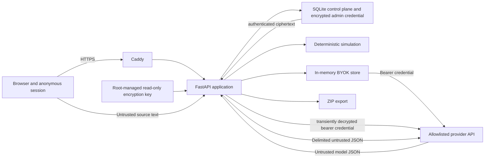

# EventShock Lab Threat Model

## 范围与状态

本威胁模型覆盖浏览器、Caddy、FastAPI、SQLite、Event Pack、导出、模型供应商调用、普通用户内存 BYOK、指定管理员加密持久凭据、仿真内核和自托管服务器。它是工程团队的当前威胁清单，不是独立渗透测试或安全认证。

独立安全审查状态：`PENDING_HUMAN_EVIDENCE`。

## 受保护资产

- 用户提供的模型供应商 API Key、管理员凭据密文及其独立加密主密钥。
- 匿名 Session 的 Event Pack 草稿、审核记录、场景、实验和导出。
- Canonical Event Pack 的事实、来源层级、knownAt 和校验值。
- 模型提示词、Schema、缓存键、决策和评估 artifact。
- 订单、成交、账本、指标和 event-log hash 的完整性。
- 服务器、容器、SQLite 卷、TLS 私钥和部署配置。
- 课程团队与用户对结果限制的正确理解。

## 信任边界

边界原则：浏览器输入、上传来源、模型输出、外部页面和供应商响应均不可信；只有通过本地 Schema、证据、时间、动作和风险检查的数据才能进入后续状态。

## 威胁主体

- 无认证的互联网访问者。
- 能猜测、窃取或诱导泄露 Session ID 的访问者。
- 上传恶意文件或提示词注入文本的用户。
- 返回错误、漂移或恶意输出的模型供应商。
- 被污染或时间错误的外部数据来源。
- 误操作或权限过大的服务器维护者。
- 供应链依赖、基础镜像或反向代理漏洞。
- 将模型结果误读为预测或建议的善意用户。

## 假设

- 服务器操作系统、Docker、DNS 和云账户由用户控制。
- HTTPS 证书由 Caddy 自动申请和续期。
- 没有真实交易连接或资金接口。
- 普通用户 BYOK 只在进程内存中保存；只有部署指定管理员可主动保存一份认证加密密文。API 永不回显完整 Key。
- 主机 root、Docker 管理员、能读取主密钥的运维人员和运行中应用进程属于信任边界；数据库密文不是针对这些主体的防护。
- 匿名 Session ID 不承担强身份认证。
- 用户不会上传必须满足医疗、金融隐私或其他受监管保密要求的数据。

若这些假设不成立，当前风险评估不再适用。

## P0 威胁与控制

| 威胁 | 攻击方式 | 现有控制 | 残余风险与状态 |
| --- | --- | --- | --- |
| Prompt injection | 来源文本要求忽略系统提示、提高可信度、删除来源或执行工具 | 抽取前确定性内容扫描、System/User 数据分离、delimiter、无工具权限、候选 Claim 人审、本地 Schema | 模式扫描与提示词都不是形式证明；实际攻击集执行不完整，`NOT_EVALUATED` |
| Future leakage | 在早期观察中加入后续公告或结果 | timezone-aware `knownAt`、PIT Store、Observation 校验、SpaceX 截止测试 | 来源时间录错仍可能泄漏；独立数据审查 `PENDING_HUMAN_EVIDENCE` |
| Unknown evidence | LLM 伪造 evidence ID | allowedEvidenceIds、本地引用校验、repair 后 ABSTAIN | 语义引用错误但 ID 合法仍需人工与语义评估 |
| Action overreach | LLM 输出订单、账本修改或工具调用 | BeliefDecision 不含执行字段、确定性订单策略、无真实工具、账本只收撮合 Trade | 未完成外部安全审查；必须防止未来接口扩大权限 |
| Schema drift | 模型返回新版本或额外字段 | Literal Schema、extra=forbid、prompt hash、缓存键、rule fallback | 供应商行为可能在相同 model ID 下漂移 |
| Cross-session | Session A 读取 Session B 状态或 Key | DB 查询绑定 session_id、BYOK 字典按 Session 隔离、Key 掩码 | Session ID 不是认证；泄露 ID 会削弱隔离 |
| Cost exhaustion | 反复触发重试、repair 或大输出 | 最大 3 次 transport attempt、1 次 repair、max_tokens、API rate limit、缓存 | 缺少全局美元预算和 Provider 日度限额，`CONTROL_GAP` |
| Source tier promotion | T4/T5 内容冒充 T1 FACT | SourceTier 与 InformationType 约束、T4/T5 FACT 拒绝、人工审核 | 来源元数据仍可能被录错或伪造 |
| Export traversal | ID 或文件名包含父目录跳转 | Session 绑定数据库查找、服务器固定 ZIP entry 名、无用户控制路径 | 需要完整恶意 ID 回归和 ZIP 消费端审查 |
| Secret disclosure | Key 出现在 API、异常、repr、日志、浏览器存储、SQLite 明文字段或 ZIP；攻击者同时取得管理员密文和主密钥 | 普通用户内存 TTL、指定管理员 Fernet 密文、独立只读主密钥、owner 校验、`repr=False`、掩码视图、导出排除、Caddy 删除 Session Header 日志 | Host root/Docker/应用进程、Crash dump、备份共置、代理和第三方日志需人工检查，`PENDING_HUMAN_EVIDENCE` |

对应机器可执行定义位于 `backend/app/governance/redteam.py`。定义存在不代表测试已运行。

## 其他威胁

### 数据污染与来源冒充

攻击者可能伪造官方网页、改变 HTML、使用相似域名或提交带错误时间的材料。当前控制依赖来源登记、T1/T2 分层、人工审核和短释义。缺少自动证书链归档、内容签名和持续链接监测。

### 指标操纵

攻击者或开发者可能改变指标公式、选择戏剧性 seed、隐藏失败运行或展示未经配对的数据。当前控制包括 matched seeds、固定 `METRIC_KEYS`、全分布、有效样本量、event-log hash 和导出。尚无独立复算签字。

### Scenario diff 绕过

请求可能同时改变多个参数或让 baseline 与 intervention 相同。Pydantic 请求模型、单干预字段和验证服务阻断这些输入。未来扩展 Scenario Schema 时必须保留结构 diff。

### 恶意上传与资源耗尽

Caddy 将请求体限制为 2 MiB，API 继续限制来源数量、单份字符数和字段大小；Event Pack 正文与元数据在抽取前经过 fail-closed 内容扫描，高风险结果阻断，中低风险结果需确认并脱敏。扫描器不解析 Office/PDF/压缩包，也不是反病毒沙箱。实验队列和 Session 保留量有限；SQLite、单 Worker 和 1 GB 容器仍可能在并发、Study、ZIP 生成或异常流量下耗尽资源，尚未完成负载测试。

### 供应链

Python 依赖锁定到具体版本，Python 与 Caddy 镜像使用 digest。应用镜像安装依赖时仍依赖包索引；当前没有 SBOM、签名验证、SLSA provenance 或持续漏洞扫描 evidence。

### 结果误导

即使系统按设计工作，用户也可能把 synthetic 情景结果当成真实预测。现有控制是双语限制、synthetic 标签、区间、版本和非建议声明。真实用户理解研究仍为 `PENDING_HUMAN_EVIDENCE`。

## 高风险设计变化

以下变化必须重做威胁模型与发布门禁：

- 增加账号、组织或多租户敏感数据。
- 接入真实交易、经纪商或支付工具。
- 允许 LLM 调用写操作工具。
- 向普通用户开放持久 BYOK、改变主密钥/加密算法、迁移或扩展持久凭据表。
- 接入真实社交用户和个人数据。
- 公布授权行情、指数数据或新闻全文。
- 将单进程部署扩展为分布式 Worker。
- 引入新的模型供应商、模型路由或工具调用。

## 当前阻断项

- 完整十类红队运行 artifact：`NOT_EVALUATED`
- 主机与容器渗透/配置审查：`PENDING_HUMAN_EVIDENCE`
- Secret 在日志、SQLite/WAL、备份、Crash Dump、容器挂载与 Host 内存中的复核：`PENDING_HUMAN_EVIDENCE`
- 全局模型成本预算：`CONTROL_GAP`
- 强身份认证：`OUT_OF_SCOPE_FOR_CURRENT_ANONYMOUS_DEMO`
- 批量 artifact invalidation：`CONTROL_GAP`
- 依赖和镜像持续漏洞扫描：`PENDING_HUMAN_EVIDENCE`
