# ENGIN 170E PROJECT

## 开发环境安装说明

## 这份 readme 是为了想要参与开发本项目的同学而写的开发说明与教程，请一定要细心阅读

## Git 与 Python 环境部署教程（请不会使用这两个工具的同学一步一步的按照教程来，遇到常见问题先自行检索，再在群内提问，不要无脑问，优先问GPT/Claude/Gemini或者Google搜索，人在国外就别用豆包/DeepSeek/百度搜索了，群里提问时先描述清楚问题）

### Git（代码同步工具）

建议在可访问外网的环境下完成安装。（以下过程用windows做演示，mac同理）

下载地址：
[Git - Install for Windows](https://git-scm.com/install/windows)

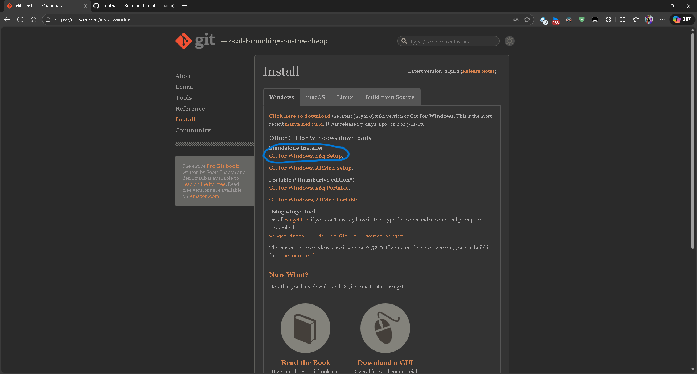

点击下载。

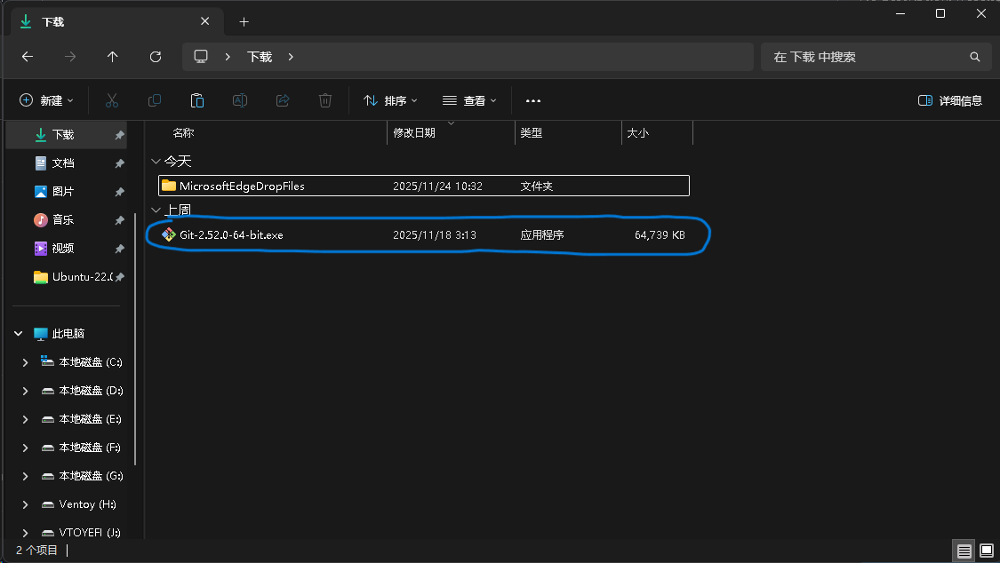

下载后双击安装程序运行。

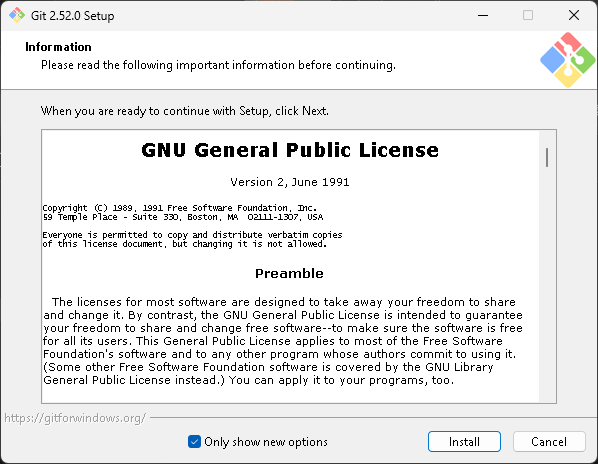

安装过程中保持默认选项即可，安装路径可自行选择。

### Python（Miniconda）

项目统一使用 Conda 管理本地 Python 环境，建议通过 Miniconda 安装。开发、测试、Docker 和部署运行时均以 **CPython 3.12.13** 为精确版本基线；后续创建 `pyproject.toml` 时，项目包的兼容范围必须声明为 `>=3.12,<3.13`。

当前阶段不要使用系统 Python 3.14，也不要把 Python 3.13 作为项目环境；同时禁止使用 `uv`、`venv`、`.venv` 或 `virtualenv` 创建本地环境。这是为了减少成员与部署环境的差异并统一 Python 补丁版本，并不表示 Python 3.13 或 3.14 本身不可用。完整复现还需要锁定依赖、平台和容器镜像摘要。

选择 3.12.13 的依据如下：

- [Mesa 3.5.1](https://pypi.org/project/Mesa/3.5.1/) 要求 Python 3.12 及以上；[Ray 2.56.0](https://pypi.org/project/ray/2.56.0/) 和 [PyTorch](https://pytorch.org/get-started/locally/) 均提供适用于 Python 3.12 的正式发行包，因此 3.12 是当前计划依赖的稳定共同基线。
- 精确锁定补丁版本可以减少成员电脑、CI 和容器之间的解释器差异。`requires-python = ">=3.12,<3.13"` 只表达项目包支持 Python 3.12 系列，不能代替环境中的 3.12.13 精确锁定。
- [Python 3.12.13](https://www.python.org/downloads/release/python-31213/) 是 Python 3.12 的安全更新版本，Python.org 不再为这一阶段的 3.12 版本提供二进制安装包，因此本地开发应按本文使用 Conda 安装，不要改用系统 Python。

下载地址：
[Free Download | Anaconda](https://www.anaconda.com/download)

打开页面后滚动到下方，选择 Miniconda 对应版本下载。

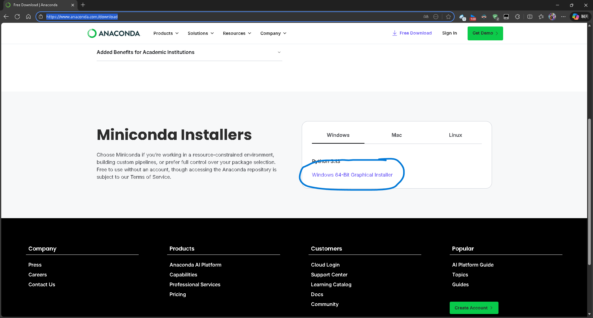
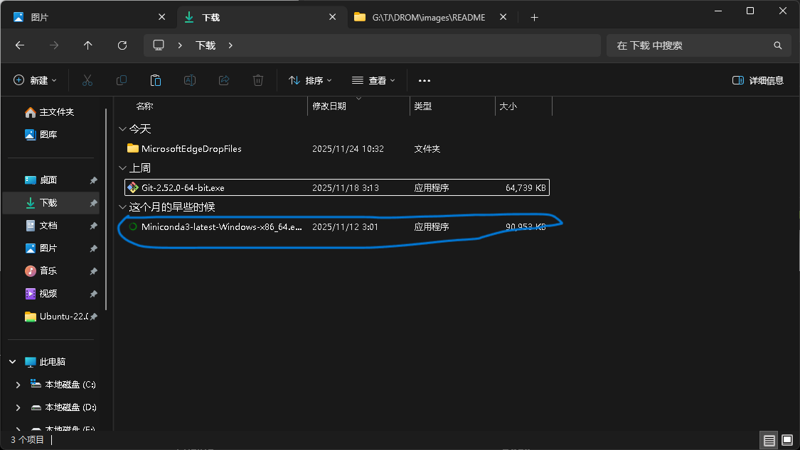
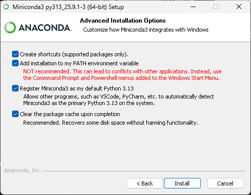

安装选项建议按图配置，便于后续在 VS Code 中调用 Python 环境。

安装完成后，以管理员身份打开终端：

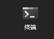

执行：

```bash
conda init --all
```

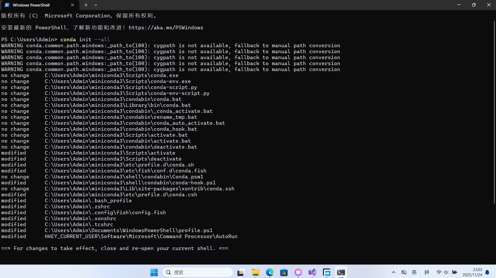

看到类似输出后，关闭终端并重新打开（建议此时关闭代理）。然后根据当前所在地和网络情况，选择下面其中一组命令执行；两个方案不需要重复执行。

以下软件源配置只供开发者本人根据网络情况按需手动选择，不授权 Agent 擅自修改用户级 Conda channel 或 pip index。

#### 在美国或其他可稳定访问官方源的地区

不需要更换 Conda 或 pip 软件源，只需执行以下命令，接受 Anaconda 默认软件源的服务条款：

```bash
conda tos accept --override-channels --channel https://repo.anaconda.com/pkgs/main
conda tos accept --override-channels --channel https://repo.anaconda.com/pkgs/r
conda tos accept --override-channels --channel https://repo.anaconda.com/pkgs/msys2
```

执行完成后，继续使用 Conda 和 pip 的官方默认软件源即可，不要执行下面的清华镜像配置命令。

#### 在中国大陆

如果访问 Conda 或 PyPI 官方软件源速度较慢，可以执行以下命令，接受 Anaconda 默认软件源的服务条款，并将 Conda 和 pip 配置为清华大学开源软件镜像站：

```bash
conda tos accept --override-channels --channel https://repo.anaconda.com/pkgs/main
conda tos accept --override-channels --channel https://repo.anaconda.com/pkgs/r
conda tos accept --override-channels --channel https://repo.anaconda.com/pkgs/msys2
conda config --add channels https://mirrors.tuna.tsinghua.edu.cn/anaconda/pkgs/main/
conda config --add channels https://mirrors.tuna.tsinghua.edu.cn/anaconda/pkgs/free/
conda config --add channels https://mirrors.tuna.tsinghua.edu.cn/anaconda/cloud/conda-forge/
conda config --add channels https://mirrors.tuna.tsinghua.edu.cn/anaconda/cloud/msys2/
conda config --add channels https://mirrors.tuna.tsinghua.edu.cn/anaconda/cloud/bioconda/
conda config --add channels https://mirrors.tuna.tsinghua.edu.cn/anaconda/cloud/menpo/
conda config --add channels https://mirrors.tuna.tsinghua.edu.cn/anaconda/cloud/pytorch/

pip config set global.index-url https://pypi.tuna.tsinghua.edu.cn/simple
```

#### 创建并验证项目 Conda 环境

先查看已有环境：

```bash
conda env list
```

如果列表中没有 `eventshock` 环境，执行：

```bash
conda create --name eventshock python=3.12.13
conda activate eventshock
```

如果该环境已经存在，只激活现有环境，不要再次执行同名 `conda create`：

```bash
conda activate eventshock
```

激活后必须运行以下命令。解释器路径应位于 `eventshock` Conda 环境中，版本输出必须为 `Python 3.12.13`；最后一条命令无输出即表示精确版本检查通过。

```bash
python -c "import sys; print(sys.executable)"
python --version
python -c "import sys; assert sys.version_info[:3] == (3, 12, 13), sys.version"
```

如果最后一条命令报错，说明同名环境不是 3.12.13。此时立即停止，不要继续安装依赖，也不要直接覆盖或删除环境；先与团队确认其中是否有需要保留的包和数据，再决定迁移或重建。Agent 未经用户明确授权不得执行删除或重建操作。

如果创建环境时出现 `PackagesNotFoundError`，不要改用 3.13、3.14 或其他 3.12 补丁版本。部分平台可使用 conda-forge 中的 3.12.13；以下 `--channel` 只影响本次命令，不会修改全局 channel：

```bash
conda create --name eventshock --channel conda-forge python=3.12.13
```

不要复用版本不同的旧环境，也不要把依赖安装到系统 Python 或 Conda 的 `base` 环境。安装项目依赖时优先使用仓库提供的依赖清单；确需用 pip 时，使用 `python -m pip`，确保安装到当前 Conda 解释器。

#### 后续配置文件的版本契约

仓库目前尚未创建下列配置。后续添加时必须保持以下内容一致，不能只修改其中一处：

`.python-version`：

```text
3.12.13
```

`environment.yml`：

```yaml
name: eventshock
dependencies:
  - python=3.12.13
```

`pyproject.toml`：

```toml
[project]
name = "eventshock"
version = "0.1.0"
requires-python = ">=3.12,<3.13"
```

`Dockerfile`：

```dockerfile
FROM python:3.12.13-slim-bookworm
```

该标签锁定 Python 补丁版本，但 Docker tag 仍可能被上游重建。若正式发布要求镜像内容不可变，应按 [Docker 官方建议](https://docs.docker.com/build/building/best-practices/#pin-base-image-versions)同时锁定经过审查的 digest，并通过依赖更新流程定期获取安全修复。

GitHub Actions：

```yaml
jobs:
  test:
    runs-on: ubuntu-24.04
    strategy:
      matrix:
        python-version: ["3.12.13"]
```

这里必须写 `3.12.13`，而不是只写 `3.12`；后者会自动选择当时可用的补丁版本，无法保证 CI 与开发、Docker 使用相同的 Python 补丁版本。当前精确的 3.12.13 必过任务限定在 Linux runner；不要直接照搬到 macOS 或 Windows runner。项目核心功能稳定后，可以新增 Python 3.13 的非阻塞 CI 兼容性任务，但不得替换 3.12.13 主任务。

### VS Code

下载地址：
[Download Visual Studio Code - Mac, Linux, Windows](https://code.visualstudio.com/Download)

安装完成后，建议至少安装以下扩展：

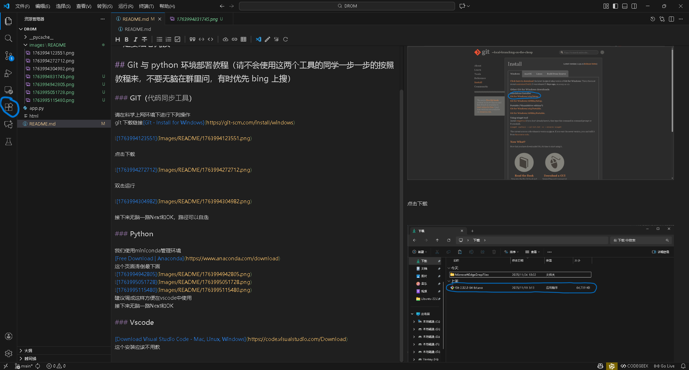

搜索 `Chinese`，安装中文语言包。

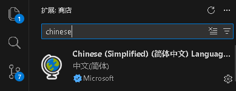

搜索 `Python`，安装 Python 官方扩展。

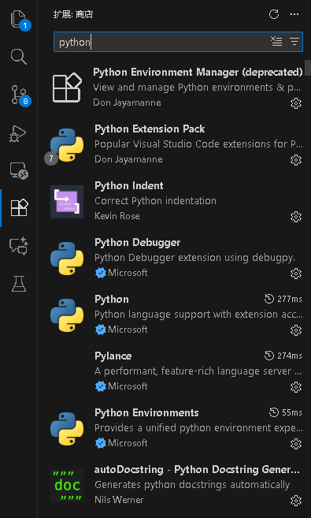

安装扩展后，在 VS Code 中打开命令面板，运行 `Python: Select Interpreter`，选择 `eventshock` 对应的 Conda 解释器。随后在 VS Code 终端中再次运行：

```bash
python --version
python -c "import sys; print(sys.executable)"
```

确认版本仍为 `Python 3.12.13`，且路径指向 `eventshock` 环境。

按以上配置完成后，即可开始项目开发。
